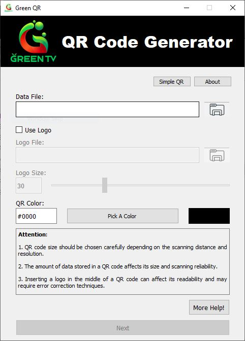
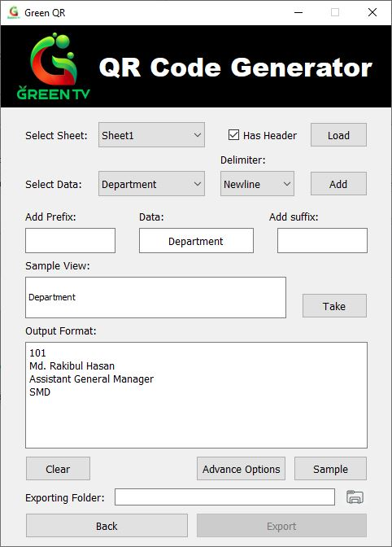
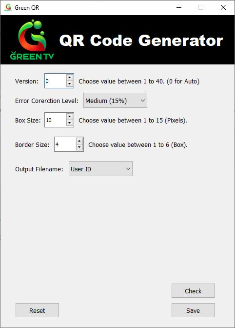
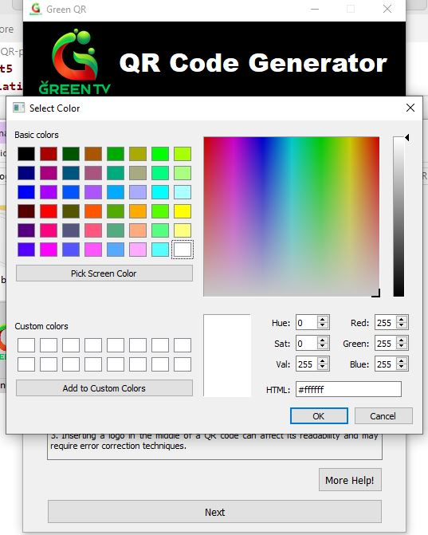

# GreenQR-pyqt5



A **desktop application** for generating customizable QR codes from Excel data or text, built with Python and PyQt5.

## ✨ Features
- ✅ Generate QR codes from **Excel files** or **plain text**
- ✅ Customize **error correction level** (L/M/Q/H)
- ✅ Adjustable **QR code size**
- ✅ Add **logo/image overlay** to QR codes
- ✅ **Template-based** QR generation from Excel data
- ✅ Simple, user-friendly PyQt5 interface

## 📦 Installation
1. Clone the repository:
   ```bash
   git clone https://github.com/salmanshovon/GreenQR-pyqt5.git
   
2.  Install dependencies:
    ```bash
    pip install -r requirements.txt

3.  Run the app:
    ```bash
    python src/main.py

## 🖼️ Screenshots


**Excel Import**


**QR Customization**


**QR Color**

## 🛠️ Tech Stack

  - **Python 3** (with `qrcode`, `openpyxl`, `Pillow`)
  - **PyQt5** (GUI framework)
  - **Qt Designer** (UI layout)

## 📝 Usage

1.  Load Excel Data (or enter text manually)
2.  Adjust Settings:
      - Error Correction (L/M/Q/H)
      - QR Size (1-10)
      - Add Logo (optional)
3.  Generate & Save QR Codes

## 📜 License

MIT License - Free for personal and commercial use.

## 📬 Contact

**Salman Mahmood**
📧 [salman.eee@yahoo.com]
💻 [GitHub Profile](https://github.com/salmanshovon)
