# 📘 Green QR - User Guide  

## **1. Simple QR Code Generation**  
### **Step-by-Step Instructions**  
1. **Open "Simple QR" Tab**  
   - Go to the *Simple QR* page from the main menu.  

2. **Enter Data**  
   - Type/paste your text in the **"Enter your data"** field.  

3. **Clear Input (Optional)**  
   - Click **"Clear"** to reset the input field.  

4. **Advanced Options (Optional)**  
   - Click **"Advanced Options"** to customize:  
     - **Version**: `1-40` (Auto = `0`)  
     - **Error Correction**: `7%-30%` (Higher = more redundancy)  
     - **Box Size**: `1-15` pixels  
     - **Border Size**: `1-6` boxes  

5. **Preview/Save**  
   - **Check**: Click **"Check"** to preview the QR.  
   - **Reset**: Revert to default settings with **"Reset"**.  
   - **Export**:  
     1. Select an **export folder**.  
     2. Enter an **output filename**.  
     3. Click **"Export"** to save (PNG/SVG).  

---

## **2. Batch QR Codes from Excel**  
### **Step-by-Step Instructions**  
1. **Open "Batch QR" Tab**  
   - Click the *Batch QR* button from the main menu.  

2. **Load Excel File**  
   - Click the **file icon** and select your Excel file (supports multi-sheet).  

3. **Customize QR (Optional)**  
   - **Logo**: Tick **"Use Logo"** to embed an image.  
   - **Color**: Use the color picker or enter a **HEX code**.  

4. **Click "Next"**  
   - Select the **Excel sheet** to process.  
   - Toggle **"Has Header"** if columns include headers.  

5. **Configure Data Template**  
   - For each column:  
     1. **Select Column** from dropdown.  
     2. Add a **Delimiter** (e.g., `-`, `|`).  
     3. Add **Prefix/Suffix** (e.g., `ID-`, `-2024`).  
     4. Click **"Take"** to apply.  
   - **Repeat** for additional columns.  

6. **Preview & Export**  
   - **Sample**: Click **"Sample"** to preview a QR for the first row.  
   - **Advanced**: Adjust QR settings via **"Advanced Options"**.  
   - **Export**:  
     1. Choose an **export folder**.  
     2. Click **"Export"** to generate all QRs (filenames = first column values).  

---

## **Tips & Notes**  
⚠️ **For Best Results**:  
- Use **Excel columns with unique values** for filenames.  
- Test with **"Sample"** before bulk export.  
- Higher **error correction** (30%) is recommended for logos.  

🛠 **Troubleshooting**:  
- If QRs fail to generate, check:  
  - Excel file is **not open** in another program.  
  - Data does not exceed **QR version capacity** (reduce text or increase version).  

---

## **Visual Workflow**  

```mermaid
graph TD
  A[Start] --> B{Simple or Batch?}
  B -->|Simple| C[Enter Data → Adjust Settings → Export]
  B -->|Batch| D[Upload Excel → Configure Columns → Export All]
```

